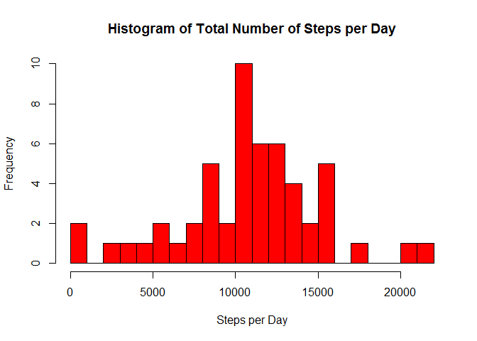
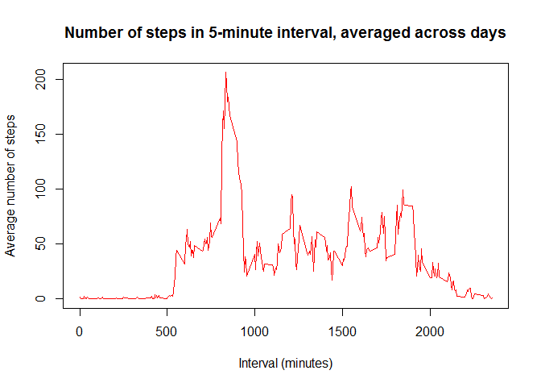
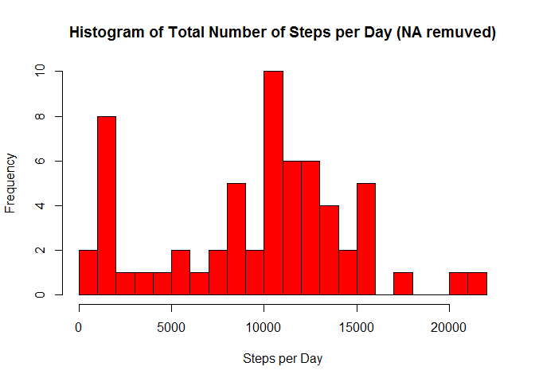
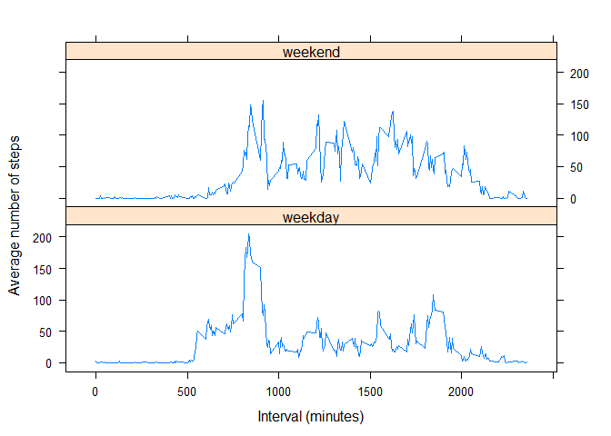

# Reproducible Research: Peer Assessment 1


##Loading and preprocessing the data


1. Load the data: 


```r
setwd("~/Data_Science_Courses/5 Reproducible Research/RepData_PeerAssessment1")
unzip("activity.zip")
activity <- read.csv("activity.csv",header = TRUE, sep = ",")
```


2. Process/transform the data into a format suitable for your analysis:


```r
#recoding the date variable to "Date" class
activity$newdate <- as.Date(activity$date)
```


## What is mean total number of steps taken per day?


(For this part, missing values in the dataset are ignored).


1. Calculate the total number of steps taken per day:


```r
stepsperday <- as.vector(tapply(activity$steps, activity$newdate, sum))
```


2. Make a histogram of the total number of steps taken each day:


```r
hist(stepsperday, main="Histogram of Total Number of Steps per Day",  xlab="Steps per Day", col="red", breaks = 20)
```

 


3. Calculate and report the mean and median of the total number of steps taken per day

Mean: 

```r
mean(stepsperday, na.rm = TRUE)
```

```
## [1] 10766.19
```

Median:

```r
median(stepsperday, na.rm = TRUE)
```

```
## [1] 10765
```


## What is the average daily activity pattern?


1. Make a time series plot (i.e. type = "l") of the 5-minute interval (x-axis) and the average number of steps taken, averaged across all days (y-axis)


```r
library(plyr)
interval.step.mean.across.days <- ddply(activity, .(interval), summarize, mean = mean(steps, na.rm = TRUE))
plot(interval.step.mean.across.days$interval, interval.step.mean.across.days$mean, type = "l", 
     main = "Number of steps in 5-minute interval, averaged across days", 
     xlab = "Interval (minutes)", ylab = "Average number of steps", col="red")
```

 

2. Which 5-minute interval, on average across all the days in the dataset, contains the maximum number of steps?


```r
interval.step.mean.across.days[which.max(interval.step.mean.across.days$mean), ]
```

```
##     interval     mean
## 104      835 206.1698
```


## Imputing missing values


1. Calculate and report the total number of missing values in the dataset (i.e. the total number of rows with NAs):


```r
sum(is.na(activity))
```

```
## [1] 2304
```

```r
#just making sure all NAs are in the "steps"" variable
sum(is.na(activity$steps))
```

```
## [1] 2304
```

```r
sum(is.na(activity$date))
```

```
## [1] 0
```

```r
sum(is.na(activity$interval))
```

```
## [1] 0
```


2. Devise a strategy for filling in all of the missing values in the dataset. 


```r
#My strategy is using median for the 5-minute interval. 
#The median is prefered, in comparison to the mean, because it is less sensitive to extreme data.
```


3. Create a new dataset that is equal to the original dataset but with the missing data filled in.


```r
library(plyr)
interval.step.median.across.days <- ddply(activity, .(interval), summarize, median = median(steps, na.rm = TRUE))
steps.narm <- vector()
for (i in 1:dim(activity)[1]) {
    if (is.na(activity$steps[i])) {
        steps.narm[i] <- interval.step.median.across.days$median[interval.step.median.across.days$interval == activity$interval[i]]
    } else {steps.narm[i] <- activity$steps[i]}
}
activity.narm <- data.frame(steps = steps.narm, date = activity$newdate, interval = activity$interval)
```


4. Make a histogram of the total number of steps taken each day and Calculate and report the mean and median total number of steps taken per day. Do these values differ from the estimates from the first part of the assignment? What is the impact of imputing missing data on the estimates of the total daily number of steps?

Histogram:

```r
stepsperday.narm <- as.vector(tapply(activity.narm$steps, activity.narm$date, sum))
hist(stepsperday.narm, main="Histogram of Total Number of Steps per Day (NA remuved)",  xlab="Steps per Day", col="red", breaks = 20)
```

 

Mean: 

```r
mean(stepsperday.narm, na.rm = TRUE)
```

```
## [1] 9503.869
```

Median:

```r
median(stepsperday.narm, na.rm = TRUE)
```

```
## [1] 10395
```

These values differ from the estimates from the first part of the assignment. The impact of imputing missing data on the estimates of the total daily number of steps is a change in the distribution, which tends to the lower left now, and decrease is mean and median.


## Are there differences in activity patterns between weekdays and weekends?


Use the dataset with the filled-in missing values for this part.


1. Create a new factor variable in the dataset with two levels - "weekday" and "weekend" indicating whether a given date is a weekday or weekend day.


```r
activity.narm$daychar <- weekdays(activity.narm$date, abbreviate = TRUE)
activity.narm$daytype[activity.narm$daychar=="Mon"] <- "weekday"
activity.narm$daytype[activity.narm$daychar=="Tue"] <- "weekday"
activity.narm$daytype[activity.narm$daychar=="Wed"] <- "weekday"
activity.narm$daytype[activity.narm$daychar=="Thu"] <- "weekday"
activity.narm$daytype[activity.narm$daychar=="Fri"] <- "weekday"
activity.narm$daytype[activity.narm$daychar=="Sat"] <- "weekend"
activity.narm$daytype[activity.narm$daychar=="Sun"] <- "weekend"
activity.narm$daytype <- as.factor(activity.narm$daytype)
```


2. Make a panel plot containing a time series plot (i.e. type = "l") of the 5-minute interval (x-axis) and the average number of steps taken, averaged across all weekday days or weekend days (y-axis). 


```r
library(plyr)
interval.step.mean.across.days.narm <- ddply(activity.narm, .(interval, daytype), summarize, mean = mean(steps))
library(lattice)
xyplot(mean ~ interval | daytype, data = interval.step.mean.across.days.narm, layout = c(1,2), type = "l", xlab = "Interval (minutes)", ylab = "Average number of steps")
```

 
